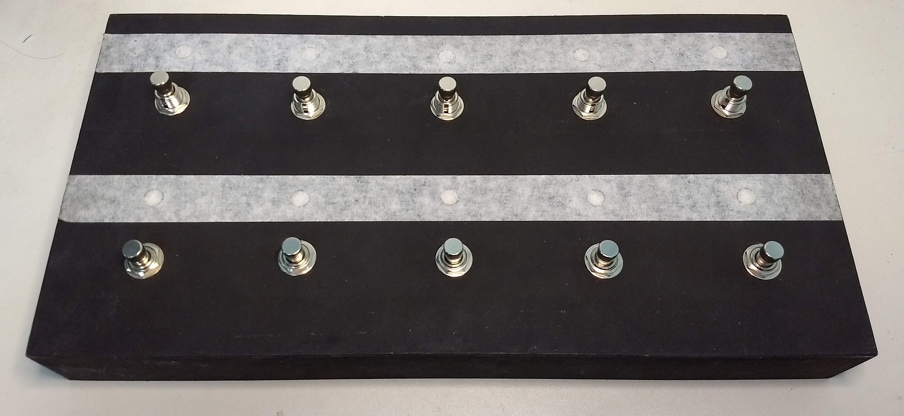
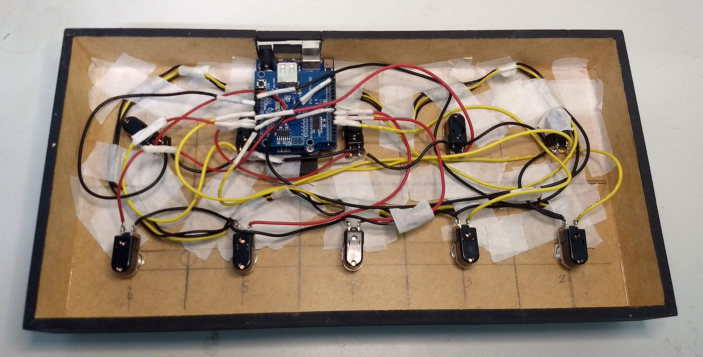

# Controlador Midi Arduino Para Pedaleira ZOOM G3 - Cod.4
# CÓDIGO 4 - 10 Presets e Modo Stomp
Controlador com <b>10</b> Pedais 
<b>5 Patches</b> nos pedais de baixo. 
Pedais de cima <b>Ativa/Desativa</b> 5 primeiros efeitos da cadeia.

 
<b>LISTA DE MATERIAIS:</b> 
1 Arduíno UNO 
1 Placa Host Shield USB 
10 Chaves Momentâneas 
10 LEDs endereçáveis 
Fios usei de Fonte de PC 
Caixa de Madeira comprada em Loja de Artesanato, com as medidas: 
36cm de largura, 18cm profundidade e 4,5cm de altura. 
 
Usei solda Cobix e ferro de solda da Hikari, é muito bom usar solda e um ferro de boa qualidade. 
Todo o esquema de ligação das chaves e leds estão bem detalhadas nas imagens.
 

<a href="https://youtu.be/zs7aZNo7nhc"><b> ** VÍDEO DE DEMONSTRAÇÃO DO FUNCIONAMENTO ** </b></a>

 

 
 

 
 

 
 

